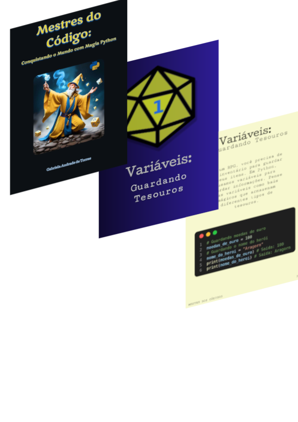

# Projeto Ebook Gerado por IA
>[!NOTE]
>Esse repositório foi desenvolvido durante o curso "Santander 2024 - Fundamentos de IA para Devs"

Nesse projeto desenvolvi um e-book utilizando IA para gerar os conteúdos. O tema foi introdução aos comandos básicos da linguagem Python voltada para adolescentes que gostam de RPG. 

📕 [Mestres do
Código:
Conquistando o Mundo com Magia Python​](https://github.com/gabistorres85/e-books/blob/master/ebook_mestres_do_codigov3.pdf)

## :desktop_computer:	Tecnologias utilizadas

1. [RemoveAI](https://removal.ai/)
2. [Figma](https://www.figma.com/pt-br/)
3. [ChatGPT](https://chatgpt.com/)
4. [Hungging Face](https://huggingface.co/)
2. Gimp

## :brain: Prompts

**ChatGPT**

|Ação  |  Prompt:|
|----  |--------|
|Título| Crie um título de um ebook sobre o tema de phyton, o ebook é para adolescentes inciando progrmaçãp, o título deve ser épico e curto, e tenha uma temática de rpg no título, me liste 5 variações de títulos|
|Conteudo| Faça um texto para ebook , com foco em pensamento computacional, listando os principais comandos Python com exemplos em código{REGRAS} Explique sempre de uma maneira simples; Deixe o texto enxuto; Sempre traga exemplos de código em contextos reais; sempre deixe um título sugestivo por tópico; faça anologias com jogos de RPG;tom de voz para adolescentes de 12 a 15 anos
|Continuação de conteúdo|Explique como rodar um arquivo py., cada passo com títulos e subtítulos, utilizando a tematica do RPG

**HuggingFace**

|Ação  |  Prompt:|
|------|---------|
|Arte da Capa| A wizard with yellow and blue clothes, rolling 20d dice in the air.

## Produzido por:

**Gabriela Andrade de Torres**

	

